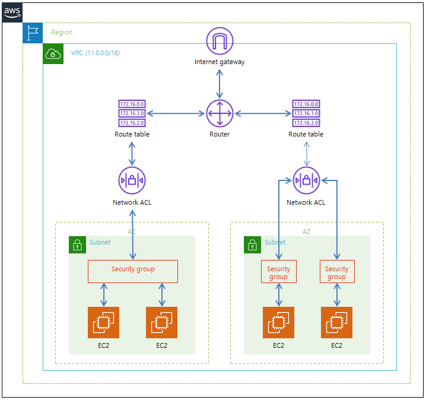
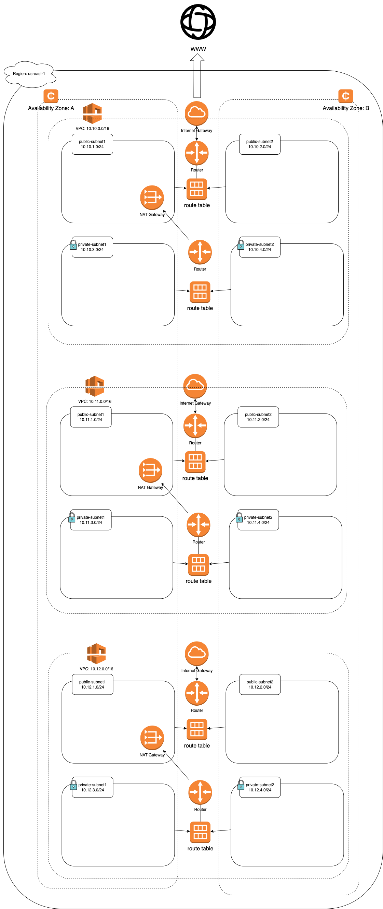

# 테라폼으로 이해하는 AWS 네트워크 구성

## 구성요소

클라우드의 네트워크는 다음과 같은 모습을 가진다.



### Internet Gateway 

VPC에서 네트워크 통신이 가능하게 함

외부 네트워크와 접점부분.

public subnet이라고 부름

route table에서 연결할 수 있다.

### NAT Gateway

NAT Gateway는 네트워크 주소변환 서비스

NAT Gateway는 public Subnet에 위치

외부 서비스에서 private network의 인스턴스로 접근이 불가능하도록 하고, private network에서 외부 서비스에 접근할 수 있도록 하는 서비스

route table을 통해서 연결할 수 있다.

### VPC(virtual private cloud)

가상의 네트워크 망

### Subnet

* public Subnet

외부와 통신이 가능. nat instance를 통하여 private subnet과 통신가능

* private Subnet

외부와 차단됨. 오직 다른 서브넷과의 연결만 허용. 대표적으로 디비 인스턴스를 private subnet에 배치한다.

외부 네트워크 망과 inbound/outbound를 허용하지 않음

### route table

라우팅이 설정되지 않은 서브넷은 정상적으로 외부와 통신이 되지 않는다.

public subnet의 0.0.0.0/0은 IGW로 설정

private subnet의 0.0.0.0/0은 NAT Gateway로 설정


### NACL(Network ACL)

서브넷을 들어오고 나가는 트래픽 제어. VPC를 위한 선택적 보안계층

서브넷은 한 개의 NACL만 가질 수 있다.

Stateless

### Security Group

인스턴스 수준에서 동작

Statefull

---

## 네트워크 구성하기

해당 예시에서는 NACL과 Security group은 별도로 정의하지 않는다.



가장 위의 VPC부터 dev, stage, prod 네트워크 대역

### dev

* vpc

```
CIDR: 10.10.0.0/16 => 10.10.0.0 ~ 10.10.255.255
```

* subnet

```
public-subnet1
  CIDR: 10.10.2.0/24 => 10.10.1.0 ~ 10.10.1.255
  AZ: a
```

```
public-subnet2
  CIDR: 10.10.2.0/24 => 10.10.2.0 ~ 10.10.2.255
  AZ: b
```

```
private-subnet1
  CIDR: 10.10.3.0/24 => 10.10.3.0 ~ 10.10.3.255
  AZ: a
```

```
private-subnet2
  CIDR: 10.10.4.0/24 => 10.10.4.0 ~ 10.10.4.255
  AZ: b
```

* NAT Gateway

public-subnet1에 위치

### stage

* vpc

```
CIDR: 10.11.0.0/16 => 10.11.0.0 ~ 10.11.255.255
```

* subnet

```
public-subnet1
  CIDR: 10.11.2.0/24 => 10.11.1.0 ~ 10.11.1.255
  AZ: a
```

```
public-subnet2
  CIDR: 10.11.2.0/24 => 10.11.2.0 ~ 10.11.2.255
  AZ: b
```

```
private-subnet1
  CIDR: 10.11.3.0/24 => 10.11.3.0 ~ 10.11.3.255
  AZ: a
```

```
private-subnet2
  CIDR: 10.11.4.0/24 => 10.11.4.0 ~ 10.11.4.255
  AZ: b
```

* NAT Gateway

public-subnet1에 위치

### prod

* vpc

```
CIDR: 10.12.0.0/16 => 10.12.0.0 ~ 10.12.255.255
```

* subnet

```
public-subnet1
  CIDR: 10.12.2.0/24 => 10.12.1.0 ~ 10.12.1.255
  AZ: a
```

```
public-subnet2
  CIDR: 10.12.2.0/24 => 10.12.2.0 ~ 10.12.2.255
  AZ: b
```

```
private-subnet1
  CIDR: 10.12.3.0/24 => 10.12.3.0 ~ 10.12.3.255
  AZ: a
```

```
private-subnet2
  CIDR: 10.12.4.0/24 => 10.12.4.0 ~ 10.12.4.255
  AZ: b
```

* NAT Gateway

public-subnet1에 위치

## 수행

### localstack 실행 & 환경변수

```bash
$ localstack start
```

* .env

```bash
export AWS_ACCESS_KEY_ID="test"
export AWS_SECRET_ACCESS_KEY="test"
export AWS_DEFAULT_REGION="us-east-1"
```

aws_secret.tf는 aws 접속을 위한 환경변수 정보를 가진다. 여기서는 .gitignore로 관리하지 않지만 aws, db 접속같은 중요 정보는 gitignore로 관리한다.

### 네트워크 생성

* dev

```
$ cd terraform/dev/network

$ terraform init

$ terraform plan

$ terraform apply
```

* stage


```
$ cd terraform/stage/network

$ terraform init

$ terraform plan

$ terraform apply
```

* prod

```
$ cd terraform/prod/network

$ terraform init

$ terraform plan

$ terraform apply
```

### scripts

편의를 위해 유틸리티 스크립트 제공

```
clean.sh

pod_load.sh

pod_save.sh

start_dev_network.sh

start_stage_network.sh

start_prod_network.sh
```

* clean.sh

./terraform 아래에 테라폼 실행을 위한 모든 파일 or 디렉터리 제거

* pod_save.sh

로컬스택의 현재 상태를 pods/pods.state로 저장

* pod_load.sh

pods/pods.state로 로컬스택 상태 로드

* start_*_network.sh

./terraform에 정의된 네트워크 테라폼 실행

### eip 조회

```bash
$ aws --endpoint-url http://localhost:4566 ec2 describe-addresses | jq

{
  "Addresses": [
    {
      "InstanceId": "",
      "PublicIp": "127.156.126.149",
      "AllocationId": "eipalloc-c0959850",
      "AssociationId": "eipassoc-0e68395f",
      "Domain": "vpc",
      "NetworkInterfaceId": "eni-4f57d533",
      "NetworkInterfaceOwnerId": "000000000000",
      "PrivateIpAddress": "10.106.81.122",
      "Tags": [
        {
          "Key": "Name",
          "Value": "dev-eip"
        }
      ]
    },
    {
      "InstanceId": "",
      "PublicIp": "127.194.4.80",
      "AllocationId": "eipalloc-78cb387e",
      "AssociationId": "eipassoc-87360f51",
      "Domain": "vpc",
      "NetworkInterfaceId": "eni-fb6c90bd",
      "NetworkInterfaceOwnerId": "000000000000",
      "PrivateIpAddress": "10.39.22.88",
      "Tags": [
        {
          "Key": "Name",
          "Value": "stage-eip"
        }
      ]
    },
    {
      "InstanceId": "",
      "PublicIp": "127.247.231.56",
      "AllocationId": "eipalloc-fd2652c6",
      "AssociationId": "eipassoc-3a32a84c",
      "Domain": "vpc",
      "NetworkInterfaceId": "eni-2ba8df0a",
      "NetworkInterfaceOwnerId": "000000000000",
      "PrivateIpAddress": "10.203.194.242",
      "Tags": [
        {
          "Key": "Name",
          "Value": "prod-eip"
        }
      ]
    }
  ]
}
```

### vpc 조회

```bash
$ aws --endpoint-url http://localhost:4566 ec2 describe-vpcs | jq

{
  "Vpcs": [
    {
      "CidrBlock": "172.31.0.0/16",
      "DhcpOptionsId": "dopt-7a8b9c2d",
      "State": "available",
      "VpcId": "vpc-bdb3f424",
      "OwnerId": "000000000000",
      "InstanceTenancy": "default",
      "Ipv6CidrBlockAssociationSet": [],
      "CidrBlockAssociationSet": [
        {
          "AssociationId": "vpc-cidr-assoc-d525416c",
          "CidrBlock": "172.31.0.0/16",
          "CidrBlockState": {
            "State": "associated"
          }
        }
      ],
      "IsDefault": true,
      "Tags": []
    },
    {
      "CidrBlock": "10.10.0.0/16",
      "DhcpOptionsId": "dopt-7a8b9c2d",
      "State": "available",
      "VpcId": "vpc-a90d405a",
      "OwnerId": "000000000000",
      "InstanceTenancy": "default",
      "Ipv6CidrBlockAssociationSet": [],
      "CidrBlockAssociationSet": [
        {
          "AssociationId": "vpc-cidr-assoc-dee0e750",
          "CidrBlock": "10.10.0.0/16",
          "CidrBlockState": {
            "State": "associated"
          }
        }
      ],
      "IsDefault": false,
      "Tags": [
        {
          "Key": "Name",
          "Value": "dev-vpc"
        }
      ]
    },
    {
      "CidrBlock": "10.11.0.0/16",
      "DhcpOptionsId": "dopt-7a8b9c2d",
      "State": "available",
      "VpcId": "vpc-45903108",
      "OwnerId": "000000000000",
      "InstanceTenancy": "default",
      "Ipv6CidrBlockAssociationSet": [],
      "CidrBlockAssociationSet": [
        {
          "AssociationId": "vpc-cidr-assoc-139717f6",
          "CidrBlock": "10.11.0.0/16",
          "CidrBlockState": {
            "State": "associated"
          }
        }
      ],
      "IsDefault": false,
      "Tags": [
        {
          "Key": "Name",
          "Value": "stage-vpc"
        }
      ]
    },
    {
      "CidrBlock": "10.12.0.0/16",
      "DhcpOptionsId": "dopt-7a8b9c2d",
      "State": "available",
      "VpcId": "vpc-9e12fc7a",
      "OwnerId": "000000000000",
      "InstanceTenancy": "default",
      "Ipv6CidrBlockAssociationSet": [],
      "CidrBlockAssociationSet": [
        {
          "AssociationId": "vpc-cidr-assoc-b4691f7c",
          "CidrBlock": "10.12.0.0/16",
          "CidrBlockState": {
            "State": "associated"
          }
        }
      ],
      "IsDefault": false,
      "Tags": [
        {
          "Key": "Name",
          "Value": "prod-vpc"
        }
      ]
    }
  ]
}
```

### subnet 조회

```bash
$ aws --endpoint-url http://localhost:4566 ec2 describe-subnets| jq

{
  "Subnets": [
    {
      "AvailabilityZone": "us-east-1a",
      "AvailabilityZoneId": "use1-az6",
      "AvailableIpAddressCount": 4091,
      "CidrBlock": "172.31.0.0/20",
      "DefaultForAz": true,
      "MapPublicIpOnLaunch": true,
      "State": "available",
      "SubnetId": "subnet-07ee2e83",
      "VpcId": "vpc-bdb3f424",
      "OwnerId": "000000000000",
      "AssignIpv6AddressOnCreation": false,
      "Ipv6CidrBlockAssociationSet": [],
      "SubnetArn": "arn:aws:ec2:us-east-1:000000000000:subnet/subnet-07ee2e83",
      "Ipv6Native": false
    },
    {
      "AvailabilityZone": "us-east-1a",
      "AvailabilityZoneId": "use1-az6",
      "AvailableIpAddressCount": 250,
      "CidrBlock": "10.10.1.0/24",
      "DefaultForAz": false,
      "MapPublicIpOnLaunch": true,
      "State": "available",
      "SubnetId": "subnet-3fd18177",
      "VpcId": "vpc-a90d405a",
      "OwnerId": "000000000000",
      "AssignIpv6AddressOnCreation": false,
      "Ipv6CidrBlockAssociationSet": [],
      "Tags": [
        {
          "Key": "Name",
          "Value": "pub-subnet1"
        }
      ],
      "SubnetArn": "arn:aws:ec2:us-east-1:000000000000:subnet/subnet-3fd18177",
      "Ipv6Native": false,
      "PrivateDnsNameOptionsOnLaunch": {
        "HostnameType": "ip-name"
      }
    },
    {
      "AvailabilityZone": "us-east-1a",
      "AvailabilityZoneId": "use1-az6",
      "AvailableIpAddressCount": 251,
      "CidrBlock": "10.10.3.0/24",
      "DefaultForAz": false,
      "MapPublicIpOnLaunch": false,
      "State": "available",
      "SubnetId": "subnet-51c7836e",
      "VpcId": "vpc-a90d405a",
      "OwnerId": "000000000000",
      "AssignIpv6AddressOnCreation": false,
      "Ipv6CidrBlockAssociationSet": [],
      "Tags": [
        {
          "Key": "Name",
          "Value": "prv-subnet1"
        }
      ],
      "SubnetArn": "arn:aws:ec2:us-east-1:000000000000:subnet/subnet-51c7836e",
      "Ipv6Native": false,
      "PrivateDnsNameOptionsOnLaunch": {
        "HostnameType": "ip-name"
      }
    },
    {
      "AvailabilityZone": "us-east-1a",
      "AvailabilityZoneId": "use1-az6",
      "AvailableIpAddressCount": 250,
      "CidrBlock": "10.11.1.0/24",
      "DefaultForAz": false,
      "MapPublicIpOnLaunch": true,
      "State": "available",
      "SubnetId": "subnet-41d24fc5",
      "VpcId": "vpc-45903108",
      "OwnerId": "000000000000",
      "AssignIpv6AddressOnCreation": false,
      "Ipv6CidrBlockAssociationSet": [],
      "Tags": [
        {
          "Key": "Name",
          "Value": "pub-subnet1"
        }
      ],
      "SubnetArn": "arn:aws:ec2:us-east-1:000000000000:subnet/subnet-41d24fc5",
      "Ipv6Native": false,
      "PrivateDnsNameOptionsOnLaunch": {
        "HostnameType": "ip-name"
      }
    },
    {
      "AvailabilityZone": "us-east-1a",
      "AvailabilityZoneId": "use1-az6",
      "AvailableIpAddressCount": 251,
      "CidrBlock": "10.11.3.0/24",
      "DefaultForAz": false,
      "MapPublicIpOnLaunch": false,
      "State": "available",
      "SubnetId": "subnet-6e53668b",
      "VpcId": "vpc-45903108",
      "OwnerId": "000000000000",
      "AssignIpv6AddressOnCreation": false,
      "Ipv6CidrBlockAssociationSet": [],
      "Tags": [
        {
          "Key": "Name",
          "Value": "prv-subnet1"
        }
      ],
      "SubnetArn": "arn:aws:ec2:us-east-1:000000000000:subnet/subnet-6e53668b",
      "Ipv6Native": false,
      "PrivateDnsNameOptionsOnLaunch": {
        "HostnameType": "ip-name"
      }
    },
    {
      "AvailabilityZone": "us-east-1a",
      "AvailabilityZoneId": "use1-az6",
      "AvailableIpAddressCount": 251,
      "CidrBlock": "10.12.3.0/24",
      "DefaultForAz": false,
      "MapPublicIpOnLaunch": false,
      "State": "available",
      "SubnetId": "subnet-56eccd4c",
      "VpcId": "vpc-9e12fc7a",
      "OwnerId": "000000000000",
      "AssignIpv6AddressOnCreation": false,
      "Ipv6CidrBlockAssociationSet": [],
      "Tags": [
        {
          "Key": "Name",
          "Value": "prv-subnet1"
        }
      ],
      "SubnetArn": "arn:aws:ec2:us-east-1:000000000000:subnet/subnet-56eccd4c",
      "Ipv6Native": false,
      "PrivateDnsNameOptionsOnLaunch": {
        "HostnameType": "ip-name"
      }
    },
    {
      "AvailabilityZone": "us-east-1a",
      "AvailabilityZoneId": "use1-az6",
      "AvailableIpAddressCount": 250,
      "CidrBlock": "10.12.1.0/24",
      "DefaultForAz": false,
      "MapPublicIpOnLaunch": true,
      "State": "available",
      "SubnetId": "subnet-bf6b8b9a",
      "VpcId": "vpc-9e12fc7a",
      "OwnerId": "000000000000",
      "AssignIpv6AddressOnCreation": false,
      "Ipv6CidrBlockAssociationSet": [],
      "Tags": [
        {
          "Key": "Name",
          "Value": "pub-subnet1"
        }
      ],
      "SubnetArn": "arn:aws:ec2:us-east-1:000000000000:subnet/subnet-bf6b8b9a",
      "Ipv6Native": false,
      "PrivateDnsNameOptionsOnLaunch": {
        "HostnameType": "ip-name"
      }
    },
    {
      "AvailabilityZone": "us-east-1b",
      "AvailabilityZoneId": "use1-az1",
      "AvailableIpAddressCount": 4091,
      "CidrBlock": "172.31.16.0/20",
      "DefaultForAz": true,
      "MapPublicIpOnLaunch": true,
      "State": "available",
      "SubnetId": "subnet-d84417ba",
      "VpcId": "vpc-bdb3f424",
      "OwnerId": "000000000000",
      "AssignIpv6AddressOnCreation": false,
      "Ipv6CidrBlockAssociationSet": [],
      "SubnetArn": "arn:aws:ec2:us-east-1:000000000000:subnet/subnet-d84417ba",
      "Ipv6Native": false
    },
    {
      "AvailabilityZone": "us-east-1b",
      "AvailabilityZoneId": "use1-az1",
      "AvailableIpAddressCount": 251,
      "CidrBlock": "10.10.2.0/24",
      "DefaultForAz": false,
      "MapPublicIpOnLaunch": true,
      "State": "available",
      "SubnetId": "subnet-3c714ab5",
      "VpcId": "vpc-a90d405a",
      "OwnerId": "000000000000",
      "AssignIpv6AddressOnCreation": false,
      "Ipv6CidrBlockAssociationSet": [],
      "Tags": [
        {
          "Key": "Name",
          "Value": "pub-subnet2"
        }
      ],
      "SubnetArn": "arn:aws:ec2:us-east-1:000000000000:subnet/subnet-3c714ab5",
      "Ipv6Native": false,
      "PrivateDnsNameOptionsOnLaunch": {
        "HostnameType": "ip-name"
      }
    },
    {
      "AvailabilityZone": "us-east-1b",
      "AvailabilityZoneId": "use1-az1",
      "AvailableIpAddressCount": 251,
      "CidrBlock": "10.10.4.0/24",
      "DefaultForAz": false,
      "MapPublicIpOnLaunch": false,
      "State": "available",
      "SubnetId": "subnet-9d191e73",
      "VpcId": "vpc-a90d405a",
      "OwnerId": "000000000000",
      "AssignIpv6AddressOnCreation": false,
      "Ipv6CidrBlockAssociationSet": [],
      "Tags": [
        {
          "Key": "Name",
          "Value": "prv-subnet2"
        }
      ],
      "SubnetArn": "arn:aws:ec2:us-east-1:000000000000:subnet/subnet-9d191e73",
      "Ipv6Native": false,
      "PrivateDnsNameOptionsOnLaunch": {
        "HostnameType": "ip-name"
      }
    },
    {
      "AvailabilityZone": "us-east-1b",
      "AvailabilityZoneId": "use1-az1",
      "AvailableIpAddressCount": 251,
      "CidrBlock": "10.11.4.0/24",
      "DefaultForAz": false,
      "MapPublicIpOnLaunch": false,
      "State": "available",
      "SubnetId": "subnet-a1c27f2c",
      "VpcId": "vpc-45903108",
      "OwnerId": "000000000000",
      "AssignIpv6AddressOnCreation": false,
      "Ipv6CidrBlockAssociationSet": [],
      "Tags": [
        {
          "Key": "Name",
          "Value": "prv-subnet2"
        }
      ],
      "SubnetArn": "arn:aws:ec2:us-east-1:000000000000:subnet/subnet-a1c27f2c",
      "Ipv6Native": false,
      "PrivateDnsNameOptionsOnLaunch": {
        "HostnameType": "ip-name"
      }
    },
    {
      "AvailabilityZone": "us-east-1b",
      "AvailabilityZoneId": "use1-az1",
      "AvailableIpAddressCount": 251,
      "CidrBlock": "10.11.2.0/24",
      "DefaultForAz": false,
      "MapPublicIpOnLaunch": true,
      "State": "available",
      "SubnetId": "subnet-59922831",
      "VpcId": "vpc-45903108",
      "OwnerId": "000000000000",
      "AssignIpv6AddressOnCreation": false,
      "Ipv6CidrBlockAssociationSet": [],
      "Tags": [
        {
          "Key": "Name",
          "Value": "pub-subnet2"
        }
      ],
      "SubnetArn": "arn:aws:ec2:us-east-1:000000000000:subnet/subnet-59922831",
      "Ipv6Native": false,
      "PrivateDnsNameOptionsOnLaunch": {
        "HostnameType": "ip-name"
      }
    },
    {
      "AvailabilityZone": "us-east-1b",
      "AvailabilityZoneId": "use1-az1",
      "AvailableIpAddressCount": 251,
      "CidrBlock": "10.12.2.0/24",
      "DefaultForAz": false,
      "MapPublicIpOnLaunch": true,
      "State": "available",
      "SubnetId": "subnet-5ae3ba53",
      "VpcId": "vpc-9e12fc7a",
      "OwnerId": "000000000000",
      "AssignIpv6AddressOnCreation": false,
      "Ipv6CidrBlockAssociationSet": [],
      "Tags": [
        {
          "Key": "Name",
          "Value": "pub-subnet2"
        }
      ],
      "SubnetArn": "arn:aws:ec2:us-east-1:000000000000:subnet/subnet-5ae3ba53",
      "Ipv6Native": false,
      "PrivateDnsNameOptionsOnLaunch": {
        "HostnameType": "ip-name"
      }
    },
    {
      "AvailabilityZone": "us-east-1b",
      "AvailabilityZoneId": "use1-az1",
      "AvailableIpAddressCount": 251,
      "CidrBlock": "10.12.4.0/24",
      "DefaultForAz": false,
      "MapPublicIpOnLaunch": false,
      "State": "available",
      "SubnetId": "subnet-d14a127c",
      "VpcId": "vpc-9e12fc7a",
      "OwnerId": "000000000000",
      "AssignIpv6AddressOnCreation": false,
      "Ipv6CidrBlockAssociationSet": [],
      "Tags": [
        {
          "Key": "Name",
          "Value": "prv-subnet2"
        }
      ],
      "SubnetArn": "arn:aws:ec2:us-east-1:000000000000:subnet/subnet-d14a127c",
      "Ipv6Native": false,
      "PrivateDnsNameOptionsOnLaunch": {
        "HostnameType": "ip-name"
      }
    },
    {
      "AvailabilityZone": "us-east-1c",
      "AvailabilityZoneId": "use1-az2",
      "AvailableIpAddressCount": 4091,
      "CidrBlock": "172.31.32.0/20",
      "DefaultForAz": true,
      "MapPublicIpOnLaunch": true,
      "State": "available",
      "SubnetId": "subnet-5de0f8af",
      "VpcId": "vpc-bdb3f424",
      "OwnerId": "000000000000",
      "AssignIpv6AddressOnCreation": false,
      "Ipv6CidrBlockAssociationSet": [],
      "SubnetArn": "arn:aws:ec2:us-east-1:000000000000:subnet/subnet-5de0f8af",
      "Ipv6Native": false
    },
    {
      "AvailabilityZone": "us-east-1d",
      "AvailabilityZoneId": "use1-az4",
      "AvailableIpAddressCount": 4091,
      "CidrBlock": "172.31.48.0/20",
      "DefaultForAz": true,
      "MapPublicIpOnLaunch": true,
      "State": "available",
      "SubnetId": "subnet-2b0aeec1",
      "VpcId": "vpc-bdb3f424",
      "OwnerId": "000000000000",
      "AssignIpv6AddressOnCreation": false,
      "Ipv6CidrBlockAssociationSet": [],
      "SubnetArn": "arn:aws:ec2:us-east-1:000000000000:subnet/subnet-2b0aeec1",
      "Ipv6Native": false
    },
    {
      "AvailabilityZone": "us-east-1e",
      "AvailabilityZoneId": "use1-az3",
      "AvailableIpAddressCount": 4091,
      "CidrBlock": "172.31.64.0/20",
      "DefaultForAz": true,
      "MapPublicIpOnLaunch": true,
      "State": "available",
      "SubnetId": "subnet-f7168764",
      "VpcId": "vpc-bdb3f424",
      "OwnerId": "000000000000",
      "AssignIpv6AddressOnCreation": false,
      "Ipv6CidrBlockAssociationSet": [],
      "SubnetArn": "arn:aws:ec2:us-east-1:000000000000:subnet/subnet-f7168764",
      "Ipv6Native": false
    },
    {
      "AvailabilityZone": "us-east-1f",
      "AvailabilityZoneId": "use1-az5",
      "AvailableIpAddressCount": 4091,
      "CidrBlock": "172.31.80.0/20",
      "DefaultForAz": true,
      "MapPublicIpOnLaunch": true,
      "State": "available",
      "SubnetId": "subnet-8ccb1e39",
      "VpcId": "vpc-bdb3f424",
      "OwnerId": "000000000000",
      "AssignIpv6AddressOnCreation": false,
      "Ipv6CidrBlockAssociationSet": [],
      "SubnetArn": "arn:aws:ec2:us-east-1:000000000000:subnet/subnet-8ccb1e39",
      "Ipv6Native": false
    }
  ]
}
```

### internet gateway 조회

```shell
$ aws --endpoint-url http://localhost:4566 ec2 describe-internet-gateways | jq

{
  "InternetGateways": [
    {
      "Attachments": [
        {
          "State": "available",
          "VpcId": "vpc-a90d405a"
        }
      ],
      "InternetGatewayId": "igw-652f0be0",
      "OwnerId": "000000000000",
      "Tags": [
        {
          "Key": "Name",
          "Value": "dev-igw"
        }
      ]
    },
    {
      "Attachments": [
        {
          "State": "available",
          "VpcId": "vpc-45903108"
        }
      ],
      "InternetGatewayId": "igw-1d012fea",
      "OwnerId": "000000000000",
      "Tags": [
        {
          "Key": "Name",
          "Value": "stage-igw"
        }
      ]
    },
    {
      "Attachments": [
        {
          "State": "available",
          "VpcId": "vpc-9e12fc7a"
        }
      ],
      "InternetGatewayId": "igw-54e51b7f",
      "OwnerId": "000000000000",
      "Tags": [
        {
          "Key": "Name",
          "Value": "prod-igw"
        }
      ]
    }
  ]
}
```

### nat gateway 조회

```bash
$ aws --endpoint-url http://localhost:4566 ec2 describe-nat-gateways | jq

{
  "NatGateways": [
    {
      "CreateTime": "2023-03-08T12:30:32.226000+00:00",
      "NatGatewayAddresses": [
        {
          "AllocationId": "eipalloc-c0959850",
          "NetworkInterfaceId": "eni-4f57d533",
          "PrivateIp": "10.106.81.122",
          "PublicIp": "127.156.126.149"
        }
      ],
      "NatGatewayId": "nat-d400a9cbeefd0888c",
      "State": "available",
      "SubnetId": "subnet-3fd18177",
      "VpcId": "vpc-a90d405a",
      "Tags": [
        {
          "Key": "Name",
          "Value": "dev-natgw"
        }
      ],
      "ConnectivityType": "public"
    },
    {
      "CreateTime": "2023-03-08T12:32:48.566000+00:00",
      "NatGatewayAddresses": [
        {
          "AllocationId": "eipalloc-78cb387e",
          "NetworkInterfaceId": "eni-fb6c90bd",
          "PrivateIp": "10.39.22.88",
          "PublicIp": "127.194.4.80"
        }
      ],
      "NatGatewayId": "nat-51b14c15134082b88",
      "State": "available",
      "SubnetId": "subnet-41d24fc5",
      "VpcId": "vpc-45903108",
      "Tags": [
        {
          "Key": "Name",
          "Value": "stage-natgw"
        }
      ],
      "ConnectivityType": "public"
    },
    {
      "CreateTime": "2023-03-08T12:33:02.013000+00:00",
      "NatGatewayAddresses": [
        {
          "AllocationId": "eipalloc-fd2652c6",
          "NetworkInterfaceId": "eni-2ba8df0a",
          "PrivateIp": "10.203.194.242",
          "PublicIp": "127.247.231.56"
        }
      ],
      "NatGatewayId": "nat-188adf9e98dc25f82",
      "State": "available",
      "SubnetId": "subnet-bf6b8b9a",
      "VpcId": "vpc-9e12fc7a",
      "Tags": [
        {
          "Key": "Name",
          "Value": "prod-natgw"
        }
      ],
      "ConnectivityType": "public"
    }
  ]
}
```

### route table 조회

```bash
$ aws --endpoint-url http://localhost:4566 ec2 describe-route-tables | jq

{
  "RouteTables": [
    {
      "Associations": [
        {
          "Main": true,
          "RouteTableAssociationId": "rtbassoc-63913088",
          "RouteTableId": "rtb-24efc48e",
          "AssociationState": {
            "State": "associated"
          }
        }
      ],
      "RouteTableId": "rtb-24efc48e",
      "Routes": [
        {
          "DestinationCidrBlock": "172.31.0.0/16",
          "GatewayId": "local",
          "Origin": "CreateRouteTable",
          "State": "active"
        }
      ],
      "Tags": [],
      "VpcId": "vpc-bdb3f424",
      "OwnerId": "000000000000"
    },
    {
      "Associations": [
        {
          "Main": true,
          "RouteTableAssociationId": "rtbassoc-d3b6c1c5",
          "RouteTableId": "rtb-13048cea",
          "AssociationState": {
            "State": "associated"
          }
        }
      ],
      "RouteTableId": "rtb-13048cea",
      "Routes": [
        {
          "DestinationCidrBlock": "10.10.0.0/16",
          "GatewayId": "local",
          "Origin": "CreateRouteTable",
          "State": "active"
        }
      ],
      "Tags": [],
      "VpcId": "vpc-a90d405a",
      "OwnerId": "000000000000"
    },
    {
      "Associations": [
        {
          "Main": false,
          "RouteTableAssociationId": "rtbassoc-0a33983e",
          "RouteTableId": "rtb-d93915ea",
          "SubnetId": "subnet-3fd18177",
          "AssociationState": {
            "State": "associated"
          }
        },
        {
          "Main": false,
          "RouteTableAssociationId": "rtbassoc-02480c48",
          "RouteTableId": "rtb-d93915ea",
          "SubnetId": "subnet-3c714ab5",
          "AssociationState": {
            "State": "associated"
          }
        }
      ],
      "RouteTableId": "rtb-d93915ea",
      "Routes": [
        {
          "DestinationCidrBlock": "10.10.0.0/16",
          "GatewayId": "local",
          "Origin": "CreateRouteTable",
          "State": "active"
        },
        {
          "DestinationCidrBlock": "0.0.0.0/0",
          "GatewayId": "igw-652f0be0",
          "Origin": "CreateRoute",
          "State": "active"
        }
      ],
      "Tags": [
        {
          "Key": "Name",
          "Value": "public-route-tabler"
        }
      ],
      "VpcId": "vpc-a90d405a",
      "OwnerId": "000000000000"
    },
    {
      "Associations": [
        {
          "Main": false,
          "RouteTableAssociationId": "rtbassoc-cbe0a81f",
          "RouteTableId": "rtb-ae691230",
          "SubnetId": "subnet-9d191e73",
          "AssociationState": {
            "State": "associated"
          }
        },
        {
          "Main": false,
          "RouteTableAssociationId": "rtbassoc-d706afc0",
          "RouteTableId": "rtb-ae691230",
          "SubnetId": "subnet-51c7836e",
          "AssociationState": {
            "State": "associated"
          }
        }
      ],
      "RouteTableId": "rtb-ae691230",
      "Routes": [
        {
          "DestinationCidrBlock": "10.10.0.0/16",
          "GatewayId": "local",
          "Origin": "CreateRouteTable",
          "State": "active"
        },
        {
          "DestinationCidrBlock": "0.0.0.0/0",
          "NatGatewayId": "nat-d400a9cbeefd0888c",
          "Origin": "CreateRoute",
          "State": "active"
        }
      ],
      "Tags": [
        {
          "Key": "Name",
          "Value": "private-route-tabler"
        }
      ],
      "VpcId": "vpc-a90d405a",
      "OwnerId": "000000000000"
    },
    {
      "Associations": [
        {
          "Main": true,
          "RouteTableAssociationId": "rtbassoc-48c0d761",
          "RouteTableId": "rtb-7c0b0f37",
          "AssociationState": {
            "State": "associated"
          }
        }
      ],
      "RouteTableId": "rtb-7c0b0f37",
      "Routes": [
        {
          "DestinationCidrBlock": "10.11.0.0/16",
          "GatewayId": "local",
          "Origin": "CreateRouteTable",
          "State": "active"
        }
      ],
      "Tags": [],
      "VpcId": "vpc-45903108",
      "OwnerId": "000000000000"
    },
    {
      "Associations": [
        {
          "Main": false,
          "RouteTableAssociationId": "rtbassoc-fdace75a",
          "RouteTableId": "rtb-76aeeb07",
          "SubnetId": "subnet-41d24fc5",
          "AssociationState": {
            "State": "associated"
          }
        },
        {
          "Main": false,
          "RouteTableAssociationId": "rtbassoc-c4ff31f1",
          "RouteTableId": "rtb-76aeeb07",
          "SubnetId": "subnet-59922831",
          "AssociationState": {
            "State": "associated"
          }
        }
      ],
      "RouteTableId": "rtb-76aeeb07",
      "Routes": [
        {
          "DestinationCidrBlock": "10.11.0.0/16",
          "GatewayId": "local",
          "Origin": "CreateRouteTable",
          "State": "active"
        },
        {
          "DestinationCidrBlock": "0.0.0.0/0",
          "GatewayId": "igw-1d012fea",
          "Origin": "CreateRoute",
          "State": "active"
        }
      ],
      "Tags": [
        {
          "Key": "Name",
          "Value": "public-route-tabler"
        }
      ],
      "VpcId": "vpc-45903108",
      "OwnerId": "000000000000"
    },
    {
      "Associations": [
        {
          "Main": true,
          "RouteTableAssociationId": "rtbassoc-c24254fa",
          "RouteTableId": "rtb-1219f661",
          "AssociationState": {
            "State": "associated"
          }
        }
      ],
      "RouteTableId": "rtb-1219f661",
      "Routes": [
        {
          "DestinationCidrBlock": "10.12.0.0/16",
          "GatewayId": "local",
          "Origin": "CreateRouteTable",
          "State": "active"
        }
      ],
      "Tags": [],
      "VpcId": "vpc-9e12fc7a",
      "OwnerId": "000000000000"
    },
    {
      "Associations": [
        {
          "Main": false,
          "RouteTableAssociationId": "rtbassoc-8773294d",
          "RouteTableId": "rtb-dfddbe62",
          "SubnetId": "subnet-a1c27f2c",
          "AssociationState": {
            "State": "associated"
          }
        },
        {
          "Main": false,
          "RouteTableAssociationId": "rtbassoc-56d3545b",
          "RouteTableId": "rtb-dfddbe62",
          "SubnetId": "subnet-6e53668b",
          "AssociationState": {
            "State": "associated"
          }
        }
      ],
      "RouteTableId": "rtb-dfddbe62",
      "Routes": [
        {
          "DestinationCidrBlock": "10.11.0.0/16",
          "GatewayId": "local",
          "Origin": "CreateRouteTable",
          "State": "active"
        },
        {
          "DestinationCidrBlock": "0.0.0.0/0",
          "NatGatewayId": "nat-51b14c15134082b88",
          "Origin": "CreateRoute",
          "State": "active"
        }
      ],
      "Tags": [
        {
          "Key": "Name",
          "Value": "private-route-tabler"
        }
      ],
      "VpcId": "vpc-45903108",
      "OwnerId": "000000000000"
    },
    {
      "Associations": [
        {
          "Main": false,
          "RouteTableAssociationId": "rtbassoc-6322972d",
          "RouteTableId": "rtb-2ae2b29f",
          "SubnetId": "subnet-bf6b8b9a",
          "AssociationState": {
            "State": "associated"
          }
        },
        {
          "Main": false,
          "RouteTableAssociationId": "rtbassoc-c1a6c042",
          "RouteTableId": "rtb-2ae2b29f",
          "SubnetId": "subnet-5ae3ba53",
          "AssociationState": {
            "State": "associated"
          }
        }
      ],
      "RouteTableId": "rtb-2ae2b29f",
      "Routes": [
        {
          "DestinationCidrBlock": "10.12.0.0/16",
          "GatewayId": "local",
          "Origin": "CreateRouteTable",
          "State": "active"
        },
        {
          "DestinationCidrBlock": "0.0.0.0/0",
          "GatewayId": "igw-54e51b7f",
          "Origin": "CreateRoute",
          "State": "active"
        }
      ],
      "Tags": [
        {
          "Key": "Name",
          "Value": "public-route-tabler"
        }
      ],
      "VpcId": "vpc-9e12fc7a",
      "OwnerId": "000000000000"
    },
    {
      "Associations": [
        {
          "Main": false,
          "RouteTableAssociationId": "rtbassoc-6e1478a3",
          "RouteTableId": "rtb-7e1e85ad",
          "SubnetId": "subnet-56eccd4c",
          "AssociationState": {
            "State": "associated"
          }
        },
        {
          "Main": false,
          "RouteTableAssociationId": "rtbassoc-d94dc9da",
          "RouteTableId": "rtb-7e1e85ad",
          "SubnetId": "subnet-d14a127c",
          "AssociationState": {
            "State": "associated"
          }
        }
      ],
      "RouteTableId": "rtb-7e1e85ad",
      "Routes": [
        {
          "DestinationCidrBlock": "10.12.0.0/16",
          "GatewayId": "local",
          "Origin": "CreateRouteTable",
          "State": "active"
        },
        {
          "DestinationCidrBlock": "0.0.0.0/0",
          "NatGatewayId": "nat-188adf9e98dc25f82",
          "Origin": "CreateRoute",
          "State": "active"
        }
      ],
      "Tags": [
        {
          "Key": "Name",
          "Value": "private-route-tabler"
        }
      ],
      "VpcId": "vpc-9e12fc7a",
      "OwnerId": "000000000000"
    }
  ]
}
```